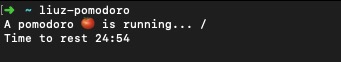
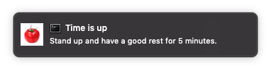

# liuz-pomodoro

A little pomodoro living inside terminal. 

## Installation

```sh
$ npm install --global liuz-pomodoro

# or using yarn
$ yarn global add liuz-pomodoro
```

## Usage

After installation, just run `liuz-pomodoro`:



Just leave it alone and focus on your job. It will remind you when time is up.

